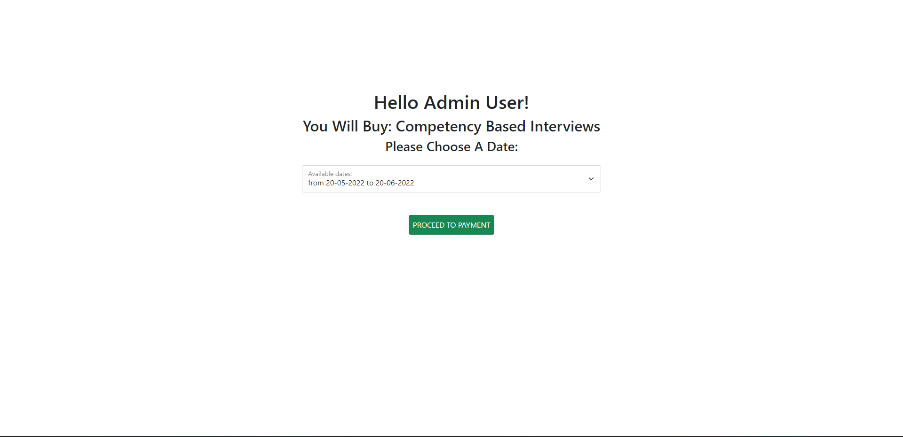

# moodle-paytabs
Paytabs payment gateway for moodle
<hr>
## Usage scenario:

- You have some courses .
- Under each course you have some course (same course with different date) .
- you want users to enroll only one date .

<hr>

## How to use ?

- create your sub-courses (dates under main course) every date like a sperated course .
- add id number to each course :
  - i.e. abbreviation-month-year :
    - i.e. HR-08-22
    - i.e. SHRM-10-22
  - Abbreviation must be unique (we will use it again latter) .
- now in buy/courses_list.php create course list like this:<br><br>
  ```php
  <?php
  
  $courses = [
      'main_course_abbreviation' => 
      [
        'name' => 'YOUR-COURSE-NAME',
        'praice' => 'YOUR-COURSE-PRICE',
         'dates' => 
         [
            'id-number-for-each-date' => 
            [
                'idnum' => 'id-number-again',
                'start_date' => 'start_date',
                'end_date' => 'end_date',
                'is_available' => true // or false (useless until now)
            ]
         ]
      ],
  ]
  
  
  // add your courses like above (list of courses. under every course its details and list of dates )
  // example:
  $courses = [
      'shrm' => [
          'name' => 'SHRM Advanced Certificate in HR Managemen',
          'price' => 1000,
          'dates' => [
              'shrm-05-22' => [
                  'idnum' => 'shrm-05-22',
                  'start_date' => '20-05-2022',
                  'end_date' => '20-06-2022',
                  'is_available' => True
              ],
              'shrm-08-22' => [
                  'idnum' => 'shrm-08-22',
                  'start_date' => '20-08-2022',
                  'end_date' => '20-09-2022',
                  'is_available' => True
              ],
          ]
      ],
      'cpi' => [
          'name' => 'Competency Based Interviews',
          'price' => 1000,
          'dates' => [
              'cpi-05-22' => [
                  'idnum' => 'cpi-05-22',
                  'start_date' => '20-05-2022',
                  'end_date' => '20-06-2022',
                  'is_available' => True
              ],
              'cpi-08-22' => [
                  'idnum' => 'cpi-08-22',
                  'start_date' => '20-08-2022',
                  'end_date' => '20-09-2022',
                  'is_available' => True
              ],
          ]
      ],
  ];

  ```
 - Replace 'YOUR-SECRET-KEY' and 'YOUR-PROFILE_ID' with your secret key and profile id in :
   - buy/paytabs.php
   - buy/pay.php
 - Copy buy/ directory to your moodle directory:
 ```
 __ moodle/:
      |
      |_ buy/
      |
      |_ index.php
 ```
 
 
<hr>

### Now you have a page allows user to select a date and proceed to payment
### Just copy link and put it anywhere and users will be able to buy your course and choose  te date
<hr>

### Link is like:
  - https://www.your-moodle-site.com/buy?id=main-course-unique-abbreviation

### The link takes user to this page to choose date and proceesd to payment:


<hr>

## Note: You must have a ssl certificate installed :
  - because Paytabs doesn't retun tran_ref unless you have ssl certificate installed
